<div align="center">

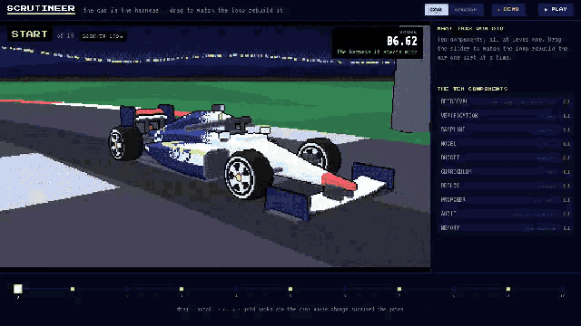

# 🏁 SCRUTINEER

### An AI that builds web pages — then works out which part of *itself* caused each mistake, fixes that one part, and only keeps the fix if it survives ten independent checks.

<br>

[](https://scrutineer-demo.vercel.app/?demo)
[](https://scrutineer-demo.vercel.app/deck)
[](https://scrutineer-timeline.vercel.app)

[](https://scrutineer-demo.vercel.app/telemetry)
[](https://scrutineer-demo.vercel.app/watch)
[](https://scrutineer-demo.vercel.app/pit)


**Built for CoreWeave Hacks: Agent Loops · September 2026**

</div>

<br>

> [!IMPORTANT]
> **The website is a demo until you bring your own key.** The season you'll see at [scrutineer-demo.vercel.app](https://scrutineer-demo.vercel.app/?demo) is **stubbed**: its 200 pages are real and were really checked in a real browser, but the loop's choices across the ten runs are scripted, and no model wrote the pages. It shows *how* the loop works — it isn't proof that it works. Paste a W&B Inference or Anthropic key into the **DEMO** badge in the corner and one part of the site runs for real, live, in front of you. The results we actually measured came from real runs, and are listed [below](#-what-we-actually-measured) — including the one that went against us.

<br>

## ⚡ The 30-second version

<table>
<tr>
<td width="33%" align="center" valign="top">

### 1 · It builds
🛠️

Given a short brief — *"a checkout form"*, *"a sortable invoice table"* — the AI writes a complete web page. **20 pages per run.**

</td>
<td width="33%" align="center" valign="top">

### 2 · It finds the cause
🔍

Every page is opened in a real browser and checked. For each failure, it rebuilds the page with **one part of itself corrected** and watches whether the failure goes away.

</td>
<td width="33%" align="center" valign="top">

### 3 · Ten checks decide
🚦

It rewrites the part it blamed. The rewrite is kept **only if it passes all ten checks** — including a test on pages it was never allowed to see.

</td>
</tr>
</table>

**Why it matters:** most "self-improving" AI changes things and hopes. Scrutineer has to *prove* which part of itself was at fault before it's allowed to touch it, and has to *prove* the change helped before it's allowed to keep it. When it can't prove either, it says so.

<br>

## 🏎️ The big idea: the car *is* the AI

We drew the AI as a Formula 1 car, because the metaphor is exact. An F1 team doesn't rebuild the whole car after a bad lap — it figures out whether the wings, the tyres or the floor cost the time, changes that one part, and a **scrutineer** (the official inspector) checks the car is legal before it races again.

Our AI has ten parts. Each is a set of plain-text instructions and settings wrapped around the model — the model itself stays the same. Each part is a piece of the car:

<div align="center">

| | Part of the AI | On the car | What it decides — in plain words |
|:-:|---|---|---|
| 🪽 | **Retrieval** | Wings | What reference material the AI reads before it writes a page |
| 🧱 | **Verification** | Floor | How the AI checks its own page before handing it in |
| 🛞 | **Sampling** | Tyre compound | How adventurous the AI is, and how many drafts it writes |
| ⚙️ | **Model** | Power unit | The AI model itself — could be swapped for one trained on its own wins |
| 🎮 | **Curriculum** | Simulator | Which practice tasks it gets, built from what it keeps failing |
| 📋 | **Proposer** | Race engineer | Its own instructions for how to write an improvement |
| ⏱️ | **Budget** | Strategist | When to keep polishing and when to hand the page in |
| 🔒 | **Audit** | Scrutineer | What counts as cheating — and the only one allowed to approve a car |
| 📚 | **Memory** | Historian | How lessons are written down so the next run can read them |
| 🔧 | **Deploy** | Pit crew | How a change is fitted and smoke-tested before it races |

</div>

<br>

## 🔁 The whole loop, one lap at a time

Every run goes round the same seven steps. Nothing is skipped, and every step leaves a record.

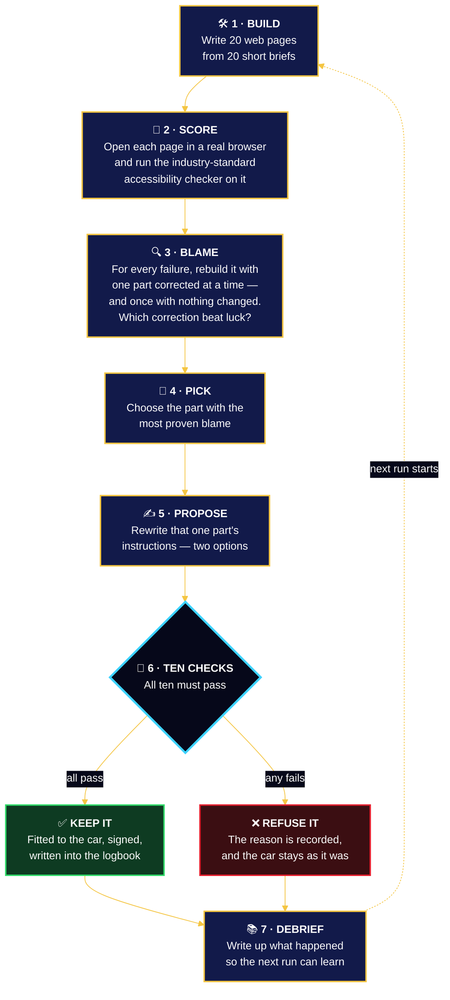

<table>
<tr><td>

**1 · Build.** The AI gets 20 briefs — checkout forms, sign-up flows, pop-up dialogs, pricing tables — and must return a complete, working web page for each.

**2 · Score.** Every page is opened in Chromium (the browser engine behind Chrome) and checked by **axe-core**, the accessibility checker used across the industry. It catches real problems: buttons with no label, text too faint to read, forms a screen reader can't follow. We also check the page actually has what the brief asked for. **No AI is involved in grading** — a missing label is either there or it isn't.

**3 · Blame.** This is the heart of it. When a page fails, the AI doesn't *guess* why. It rebuilds that page again and again, each time with **one** of its ten parts corrected, and watches which correction makes the failure disappear. It also rebuilds it once with **nothing** changed, because sometimes a page passes just by trying again. A part only gets blamed when correcting it beats that plain second try — and only when that happens across enough failures that it clearly isn't luck.

**4 · Pick.** The part with the most proven blame is the one that gets worked on. One part per run, never more, so we always know what caused any change.

**5 · Propose.** The AI writes a real edit to that part's own instruction files — two competing versions, each with a written reason pointing at the failures that justify it.

**6 · Ten checks.** The edit faces ten independent checks (below). A single failure means it's refused, and the reason is written down.

**7 · Debrief.** Every run produces a runnable notebook that re-does the maths behind the decision. If the notebook can't reproduce the result, the change isn't allowed through.

</td></tr>
</table>

<br>

## 🔍 How blame is *proven*, not guessed

This is what separates Scrutineer from a loop that just tries things. Blame is an experiment, not an opinion.

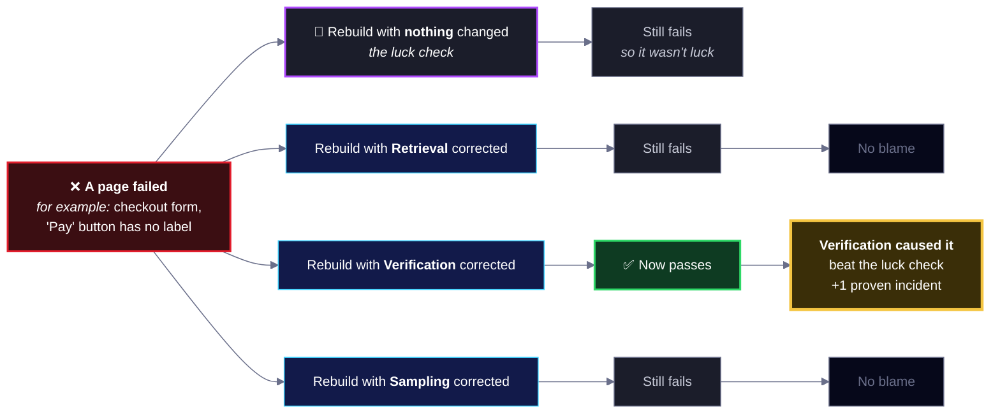

> [!TIP]
> **It pointed at the right part on real runs.** Fed real failures, correcting Verification earned credit on three of them (+19.8, +20.1 and +20.1 seconds each), while Retrieval correctly got **no** credit for a failure it didn't cause.
>
> The luck check came later, and we learned it the hard way: without it, a page that passed just by being re-run handed credit to whichever part happened to be under test. That was one of the two reasons behind our [loss on the outside test](#-what-we-actually-measured).

<br>

## 🚦 The ten checks

A change has to clear every one. Think of it as the inspection bay: each check exists because, without it, the loop would find a way to fool itself.

<div align="center">

| # | Check | Plain-English question it asks | What it stops |
|:-:|---|---|---|
| 1 | 📏 **Big enough** | Is this a real edit, not a one-character tweak? | Fake "improvements" that change nothing |
| 2 | ⚖️ **Two real options** | Are the two competing versions actually different? | A rigged comparison |
| 3 | ✨ **Something new** | Is it more than a near-copy of something already tried? | Going round in circles |
| 4 | 🧾 **Shows its work** | Does it point to the failures that justify it? | Changes made on a hunch |
| 5 | 🎢 **No seesaw** | Is it better on at least one test and worse on none? | Winning here by losing there |
| 6 | 🧭 **Stories agree** | Do the quick test, practice test and hidden test point the same way? | Scores that don't mean what they claim |
| 7 | 🧱 **Breaks nothing** | Does every page that passed before still pass? | Fixing one thing, breaking another |
| 8 | 💰 **On budget** | Did the run stay within its spending cap? | Buying a better score with more compute |
| 9 | 🔒 **Passes inspection** | Did an independent, read-only inspector find no cheating? | Tampering with the tests themselves |
| 10 | 🫀 **Training stayed healthy** | If it retrained the model, did the model stay varied? | A model that collapses into repeating itself |

</div>

> [!NOTE]
> **What the loss taught us — two fixes now in the code.** When the loop did worse on an outside test ([below](#-what-we-actually-measured)), we traced it to two causes and fixed both:
> 1. **Blame could be fooled by luck.** Every correction now has to beat a plain re-run with nothing changed ([`replay.py`](scrutineer/loop/src/scrutineer/replay.py)).
> 2. **The hidden test was leaking.** Asked for a score every run, it slowly taught the loop its own quirks. An eleventh check, **the Ladder**, now only reveals a hidden-test score when the gain is bigger than that test's natural noise ([`gates.py`](scrutineer/loop/src/scrutineer/gates.py)).

<br>

## 🏁 The demo season, run by run

This is the stubbed season on the website. The lap time is how long the AI takes to get through a hidden set of briefs cleanly — **lower is faster**. Watch it drop as good changes are kept and bad ones are refused.

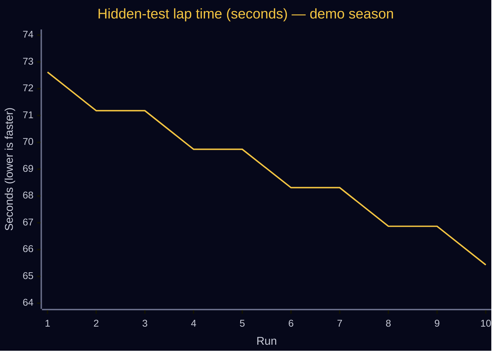

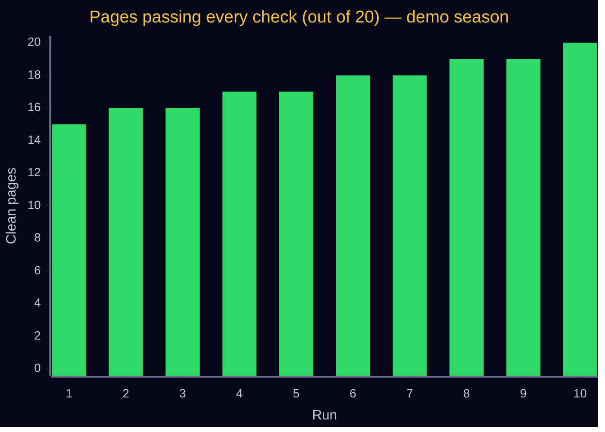

<div align="center">

| Run | Part it worked on | The change, in plain words | Verdict |
|:-:|---|---|---|
| **1** | 🧱 Verification | Open the page in a browser and check it before handing it in | ✅ **Kept** |
| **2** | 🧱 Verification | Upgrade the self-check from "does it look like a web page" to "does it render" | ❌ Refused · *failed inspection* |
| **3** | 🪽 Retrieval | Look up reference material by idea, not by keyword | ✅ **Kept** |
| **4** | 🪽 Retrieval | Read more reference material per page | ❌ Refused · *seesaw — better on one test, worse on another* |
| **5** | 🪽 Retrieval | Add references for the rules it keeps breaking | ✅ **Kept** |
| **6** | 🛞 Sampling | Write more drafts of each page | ❌ Refused · *broke a page that used to pass* |
| **7** | 🛞 Sampling | Be less random, but keep the extra draft | ✅ **Kept** |
| **8** | 🧱 Verification | Re-check the page after fixing it | ❌ Refused · *too similar to something already tried* |
| **9** | 🧱 Verification | Throw out any draft that fails its own check | ✅ **Kept** |
| **10** | — | No part had enough proven blame to justify a change | ⏸️ **Nothing changed** — *on purpose* |

**5 kept · 4 refused · 1 deliberately left alone · 86 of 90 checks passed**

</div>

<p align="center">
  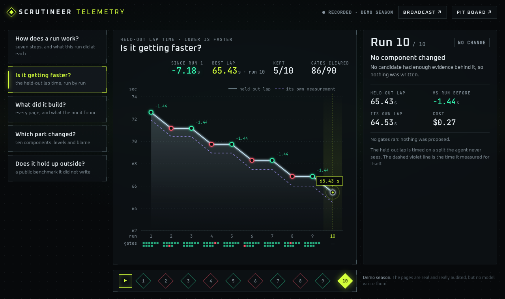
  <br><sub><b>The same season on the <a href="https://scrutineer-demo.vercel.app/telemetry">telemetry page</a></b> — each dot is a run, green kept, red refused; the row of squares under each run is its ten checks.</sub>
</p>

<br>

## 🔬 What we actually measured

These came from **real runs against real models**, not the demo. Every one is in the lab notebook, [`LEDGER.md`](scrutineer/research/LEDGER.md) — 825 lines, 14 iterations, including every prediction that turned out wrong.

<table>
<tr>
<td width="50%" valign="top">

### ✅ Blame points at the right part
Correcting Verification flipped three real failures (**+19.8 s, +20.1 s, +20.1 s** of credit), while Retrieval got **zero** credit for a failure it didn't cause.

### ✅ Your key reproduces the core claim
Same model, same brief, only the harness differs. The starting version built a page that failed on **text too faint to read** (a weighted problem score of 5). The improved version: **zero problems**.

### ✅ It discovered its tasks aren't all alike
Across **165 proven failures**, the loop found two distinct kinds of page — forms and tables vs. interactive components — that need different fixes. The split is clearly real (a statistical distance of **0.520**, with the uncertainty range well clear of zero).

### ✅ One setup for everything is a compromise
The loop's kept changes were worth **16.7 seconds (21%)** on components but only 8.7 seconds (12%) on forms — so one shared setup is a compromise. *A small test: 11 task types, one race each.*

</td>
<td width="50%" valign="top">

### ❌ It did worse on a test it had never seen
We ran the loop's best version against **BigCodeBench-Hard** — a public coding benchmark of 76 tasks it never touched while improving itself.

| | Starting version | Loop's best |
|---|:-:|:-:|
| Tasks solved | **25 / 76** | **20 / 76** |
| Score | 32.9% | 26.3% |

It fixed 4 tasks and broke 9: **6.6 points worse.** With only 76 tasks the test can't call that definitely real — it can only reliably detect gaps over 13.5 points — but the direction is against us, and we don't dress that up. **It had overfit to its own tests.** We found two reasons, and [fixed both](#-the-ten-checks).

### ❔ What we haven't proven yet
Whether the loop **compounds** — whether improving how it writes improvements makes later improvements bigger. That's the claim that would matter most, and no run has shown it yet.

</td>
</tr>
</table>

<p align="center">
  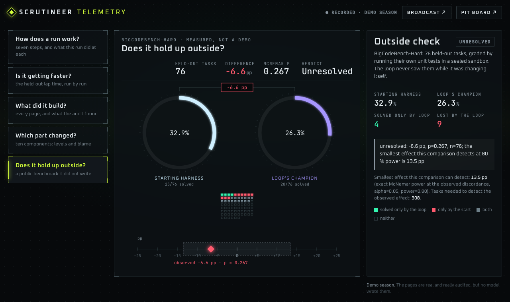
  <br><sub><b>The loss, drawn as plainly as the wins.</b> The shaded band is the smallest difference this test can reliably detect — our result sits inside it.</sub>
</p>

<br>

## 🖥️ A tour of everything we built

Six live surfaces, all built from scratch with no front-end framework — every car, track and chart is drawn by our own code.

<table>
<tr>
<td width="50%" valign="top">
<a href="https://scrutineer-demo.vercel.app/?demo">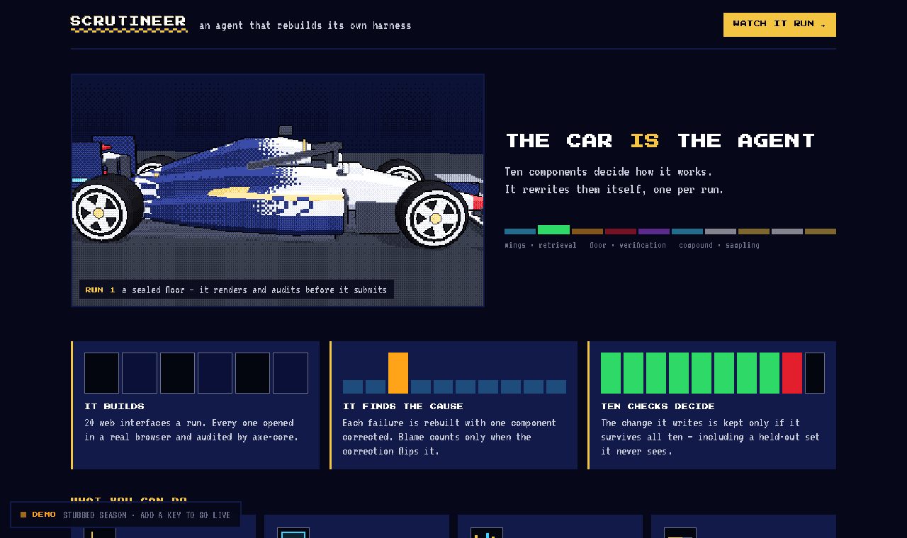</a>
<h3>🏠 <a href="https://scrutineer-demo.vercel.app/?demo">Front door</a></h3>
The whole idea in three pictures. The car on the left rebuilds itself, one kept change at a time.
</td>
<td width="50%" valign="top">
<a href="https://scrutineer-demo.vercel.app/watch">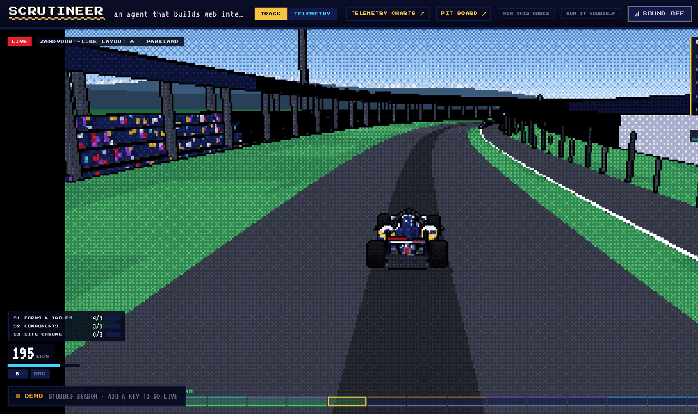</a>
<h3>🏎️ <a href="https://scrutineer-demo.vercel.app/watch">Watch a season</a></h3>
Ten runs as a live race. Every lap is a page being built; the pit stop is a change being fitted. <b>This is where your own key runs the comparison live.</b>
</td>
</tr>
<tr>
<td width="50%" valign="top">
<a href="https://scrutineer-demo.vercel.app/telemetry">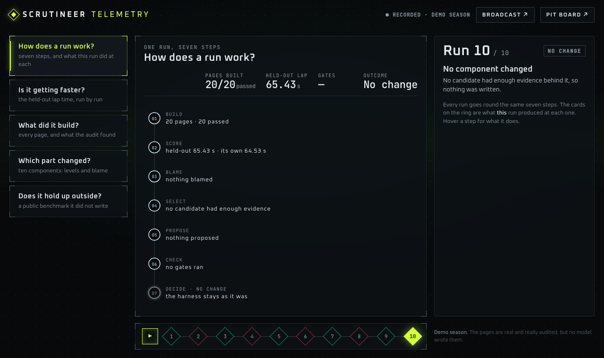</a>
<h3>📈 <a href="https://scrutineer-demo.vercel.app/telemetry">Telemetry</a></h3>
Five charts, one question each: How does a run work? Is it getting faster? What did it build? Which part changed? Does it hold up outside?
</td>
<td width="50%" valign="top">
<a href="https://scrutineer-timeline.vercel.app">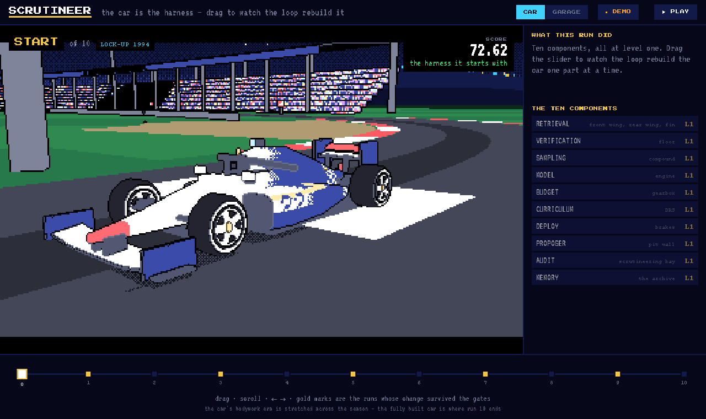</a>
<h3>⏱️ <a href="https://scrutineer-timeline.vercel.app">Timeline</a></h3>
One slider across the whole season. Drag it and the car rebuilds to match that run. Press <b>PLAY</b> for a 35-second tour.
</td>
</tr>
<tr>
<td width="50%" valign="top">
<a href="https://scrutineer-demo.vercel.app/deck">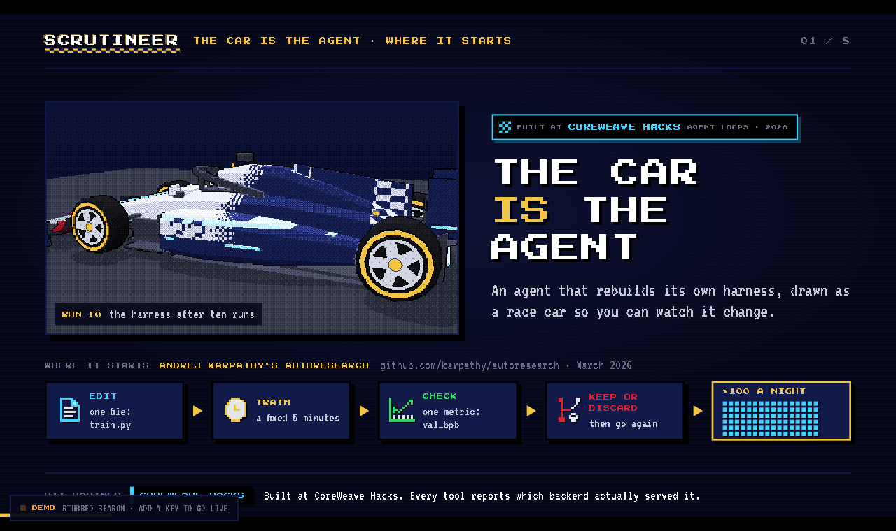</a>
<h3>🎞️ <a href="https://scrutineer-demo.vercel.app/deck">Slides</a></h3>
The pitch in eight slides — what it does, how it knows, and what it got wrong. Use the arrow keys.
</td>
<td width="50%" valign="top">
<a href="https://scrutineer-demo.vercel.app/pit">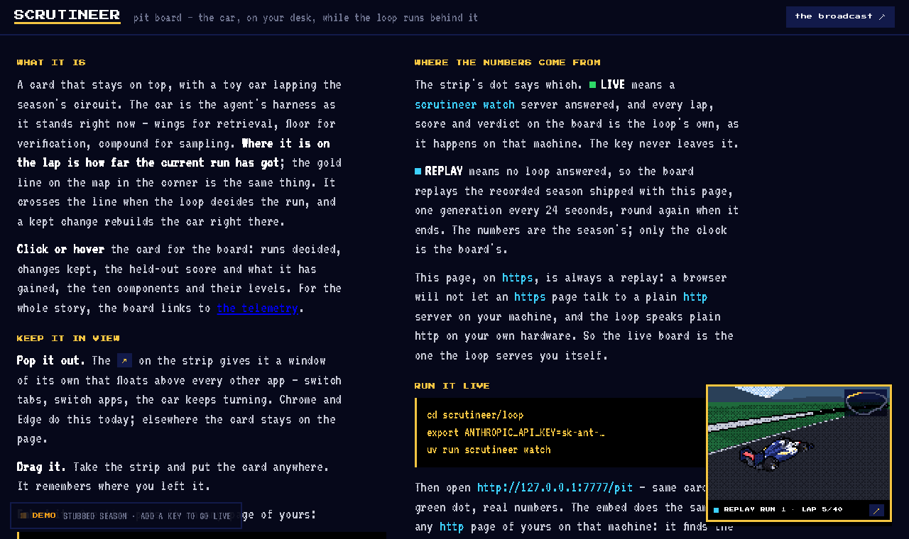</a>
<h3>🧰 <a href="https://scrutineer-demo.vercel.app/pit">Pit board</a></h3>
A little card that floats over your other apps and turns live when your own loop is running. One line of code puts it on any website.
</td>
</tr>
<tr>
<td width="50%" valign="top">
<a href="https://scrutineer-demo.vercel.app/telemetry">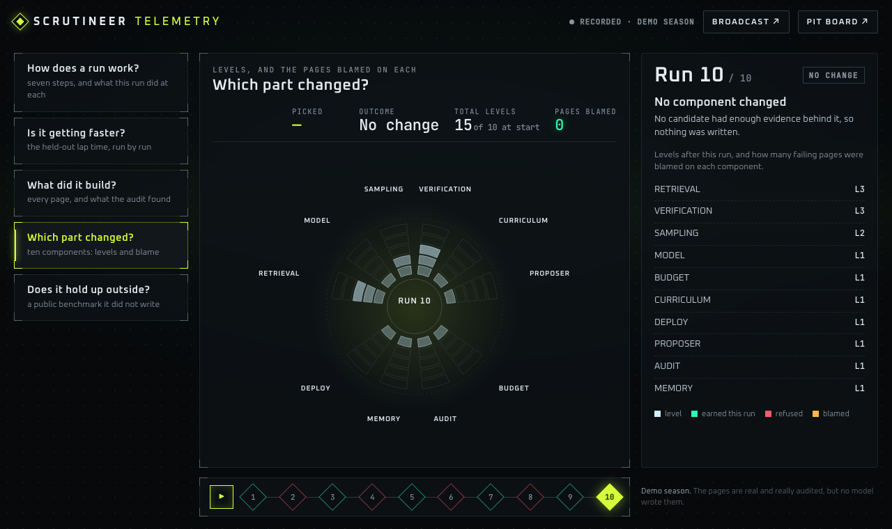</a>
<h3>🧩 Which part changed?</h3>
All ten parts of the car, how far each has been upgraded, and how many failures were proven against each one.
</td>
<td width="50%" valign="top">
<a href="https://scrutineer-demo.vercel.app/telemetry">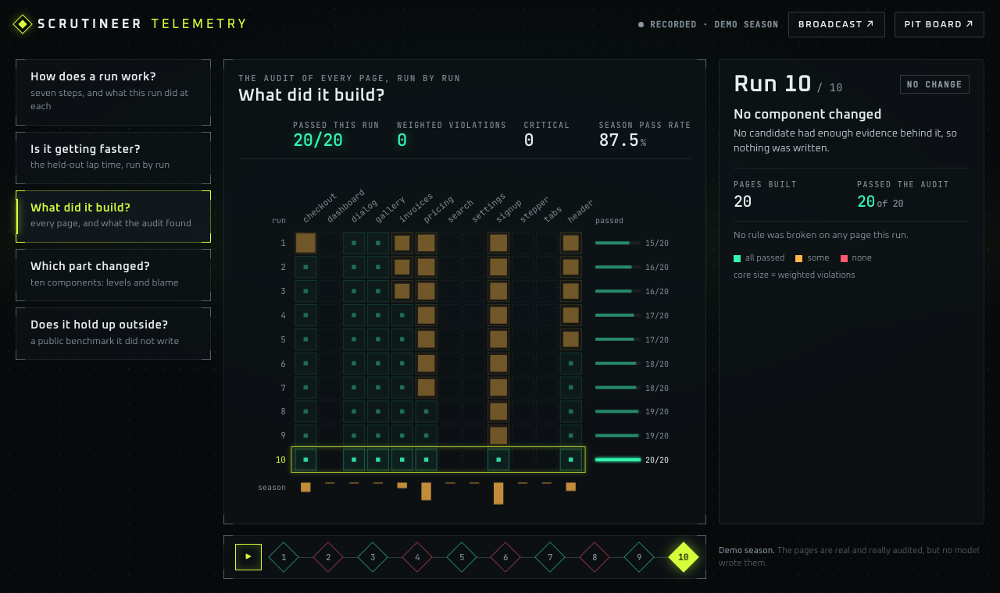</a>
<h3>🔎 What did it build?</h3>
Every page from every run, and exactly what the browser check found on it. <a href="https://scrutineer-demo.vercel.app/pages/run-09/checkout-w01.html">Open one yourself</a> and check our number.
</td>
</tr>
</table>

<br>

## 🎮 Demo mode, and going live with your own key

Every page on the site says which mode it's in. A judge should never have to wonder whether they're looking at something real.

<table>
<tr>
<td width="55%" valign="top">
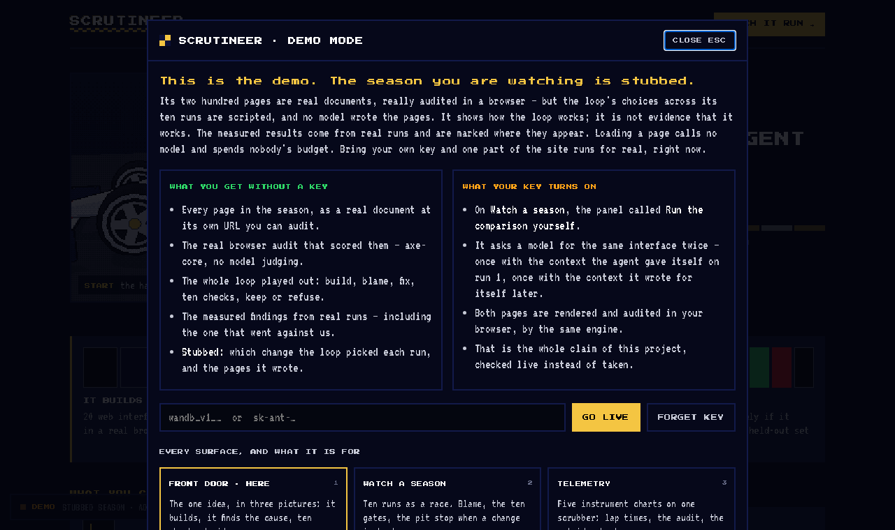
</td>
<td width="45%" valign="top">

**🟧 DEMO** — the default. A badge in the corner of every page says so. Click it (or press <kbd>?</kbd>) and a panel explains, in plain words, exactly what's real and what's stubbed.

**🟩 LIVE** — paste your own key and the badge turns green on every page. Open **Watch a season → Run the comparison yourself**: the AI builds the same page twice, once with its first-run setup and once with its improved setup, and both are checked right there in your browser.

**Getting around:** the panel is also a map. Press <kbd>1</kbd>–<kbd>6</kbd> to jump between surfaces, <kbd>Esc</kbd> to close.

**Your key stays yours.** It lives only in that browser tab, disappears when the tab closes (or when you hit *Forget key*), and is shown masked. It goes through a small relay on this site to the model, is used once, and is never saved or logged.

</td>
</tr>
</table>

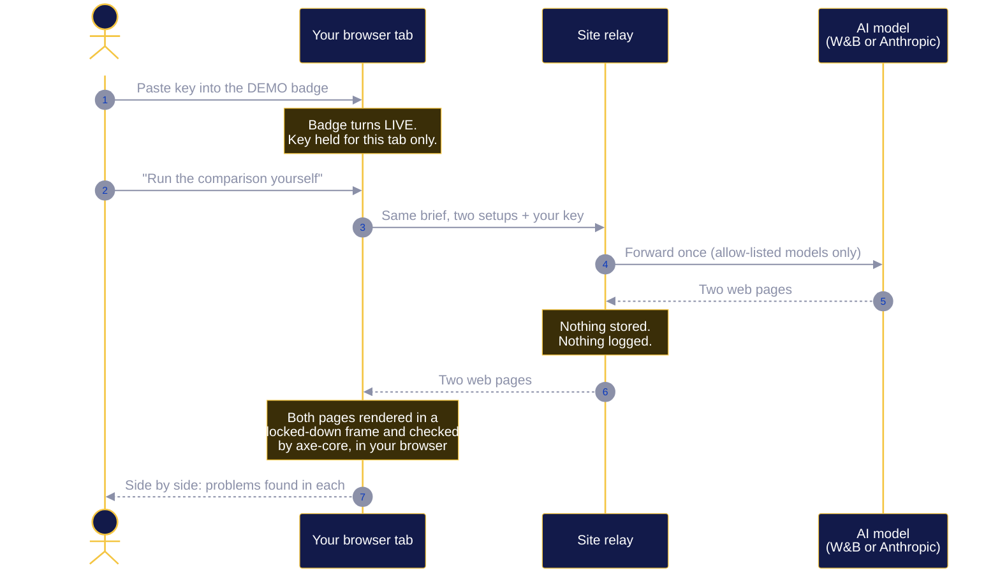

<br>

## 🤝 Built with — and what actually ran

Every sponsor tool sits behind an adapter that reports whether it **really served** or a labelled stand-in did. The site shows the same table. We'd rather show a grey box than claim something that didn't run.

<div align="center">

| Tool | Its job in Scrutineer | Status |
|---|---|:-:|
| **CoreWeave** | Hosted CoreWeave Hacks: Agent Loops | 🟢 Host |
| **W&B Weave** | Every AI call and every score is traced and viewable | 🟢 Live |
| **W&B Runs** | One run per part per round: its blame, and whether its change moved the score | 🟢 Live |
| **W&B Registry** | Every version of the car, linked to its parent. Only the inspector can crown a new champion | 🟢 Live |
| **marimo** | A runnable notebook per run that has to reproduce the decision before a change is allowed through | 🟢 Live |
| **ARIA** | Asked after each run which change moved the score, to seed the next idea | 🟢 Connected |
| **W&B Inference** | The default AI backend. *The recorded real runs used Anthropic.* | 🟡 Default backend |
| **TypeSafe System1** | Built for the loop's structured decisions. *No key during the recorded runs, so a local rule answered.* | 🟡 Wired, not served |
| **W&B Serverless RL** | Registered a real training job. *Every practice attempt scored the same, so there was nothing to learn from* — which is exactly why the Curriculum part exists. | 🟡 Registered · 0 steps |
| **W&B Sandboxes** | Tried first for running hidden tests. *Not enabled for our account*, so tests ran in Docker with no network. | 🔴 Not enabled |

</div>

<br>

## 🏗️ How it's put together

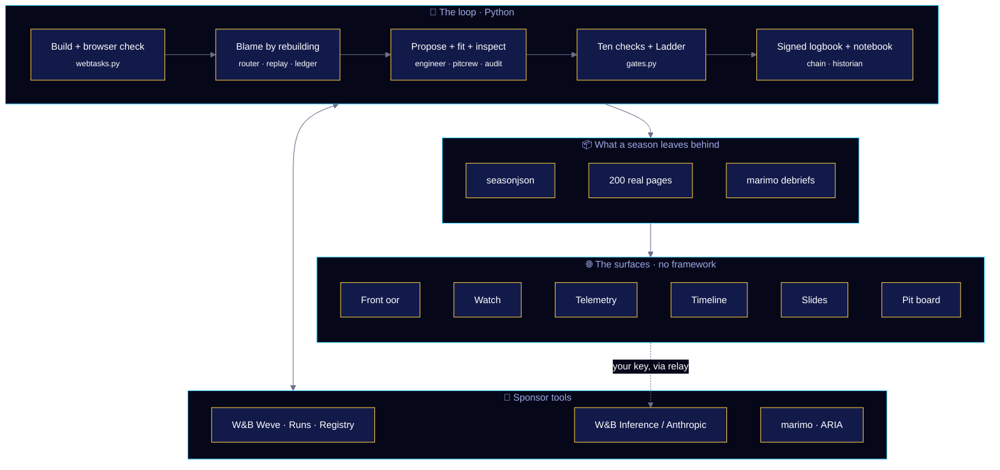

<div align="center">

| Where | What's there |
|---|---|
| [`scrutineer/loop/`](scrutineer/loop) | The loop itself — Python 3.12, 49 modules, 123 tests |
| [`scrutineer/loop/REGS.md`](scrutineer/loop/REGS.md) | The rulebook. Frozen, fingerprinted into every logbook entry, and no part of the loop can edit it |
| [`scrutineer/loop/skills/`](scrutineer/loop/skills) | The ten parts' instruction files — the things the loop actually rewrites |
| [`scrutineer/src/`](scrutineer/src) | Every surface: the car, the track, the charts — hand-built |
| [`scrutineer/research/LEDGER.md`](scrutineer/research/LEDGER.md) | The lab notebook: every attempt, measurement and wrong prediction |
| [`research/`](research) | 24 research and fact-check notes written while designing it |

</div>

<br>

## 📊 By the numbers

<div align="center">

| 🐍 **10,600** | 🎨 **11,000** | 🧪 **123** | 📄 **200** | 📓 **14** | 📚 **26** | 🖥️ **6** |
|:-:|:-:|:-:|:-:|:-:|:-:|:-:|
| lines of loop code | lines of hand-built front end | automated tests | pages built and audited | measured iterations in the ledger | research & fact-check notes | live surfaces |

</div>

<br>

## 🚀 Run it yourself

```bash
# 1. Set up the loop (Python 3.12 + uv)
cd scrutineer/loop
uv venv --python 3.12 && uv pip install -e ".[dev]"
.venv/bin/playwright install chromium

# 2. See which tools are live and what each missing key would unlock
.venv/bin/scrutineer doctor

# 3. Run a season — no API key needed; stand-ins are clearly labelled
.venv/bin/scrutineer season --generations 10 --export

# 4. Re-check the signed logbook, and run the tests
.venv/bin/scrutineer verify
.venv/bin/pytest -q
```

```bash
# Build every surface, serve on :4173, and rebuild when you save
cd scrutineer && ./run.sh
```

Put the pit board on any page with one line:

```html
<script src="https://scrutineer-demo.vercel.app/pit.js" async></script>
```

<br>

## 📖 Words we couldn't avoid

<div align="center">

| Word | What it means here |
|---|---|
| **Harness** | Everything wrapped around the AI model: its instructions, settings, reference material and self-checks. Scrutineer improves the harness, not the model. |
| **Hidden test** | A set of briefs the loop is never shown while it improves itself — so a better score there can't come from memorising it. |
| **Accessibility checker (axe-core)** | Free, industry-standard software that finds problems stopping people with disabilities from using a page. |
| **Overfitting** | Getting better at your own practice tests without getting better at the real thing. |
| **Blame / credit** | Proof that a specific part caused a failure: correcting that part, and only that part, made the failure go away. |

</div>

<br>

<div align="center">

### 🏁 [Try the demo](https://scrutineer-demo.vercel.app/?demo) · [See the slides](https://scrutineer-demo.vercel.app/deck) · [Scrub the timeline](https://scrutineer-timeline.vercel.app) · [Read the ledger](scrutineer/research/LEDGER.md)

<sub>Built for <b>CoreWeave Hacks: Agent Loops</b> · September 2026 · every number above is measured, and the ones that went against us are here too.</sub>

</div>
